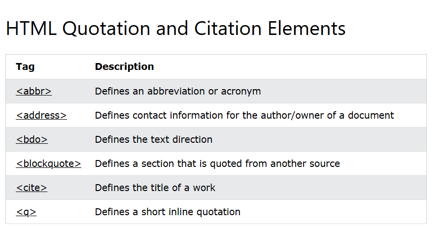

## Reference From
Document from: [Doc Mikelopster](https://www.w3schools.com/html/default.asp) 
Document from: [KongRuksiam Official](https://www.youtube.com/watch?v=0hfeNPM7piw&t=1308s)

## Basic Html
* The `<html>`element is the root element of an HTML page. 
* The `<head>` element contains meta information about the HTML page.
* The `<title>` element specifies a title for the HTML page //ชื่อเว็บที่ขึ้นบนแท็บบาร์
* The `<body>` element defines the document's body, and is a container for all the visible contents.
* The `<h1>` element defines a largest heading
* The `<h6>` element defines a smallest heading
* The `
` element defines a paragraph
* The ` ` element defines a line break(New lines).
* The `
` element is used to separate content(เส้นขีดยาว)
* The `<pre>` element defines preformatted text.(เว้นตามที่เราพิมเป๊ะๆ)

ex. คำสั่งที่ใช้ขยายในคำสั่งอีกที เช่น `
Menu
` title ในที่นี้คือถ้าเอาเม้าส์ำปชี้พารากราฟมันจะขึ้นคำอธิบายว่าeiei*

## Style
* The style attribute is used to add styles to an element, such as color, font, size, and more //กำหนดขนาด,สี,ฟอนต์

<pre>
- Use `background-color` for background color _
- Use `color` for text colors                  |
- Use `font-family` for text fonts             |-> CSS
- Use `font-size` for text sizes               |
- Use `text-align` for text alignment         _|
</pre>

* The `lang` attribute of the <html> tag declares the language of the Web page//ใช้กำหนดภาษาของhtml
* The `title` attribute defines some extra information about an element 

## Html Links
* Html Links ( <a> ) => The link's destination is specified in the href attribute. 
ex. `<a href="page2.html">P2</a>` // inline page2.html is a link that u want to connect, P2 is Name of a link

❌ สิ่งที่ HTML ไม่สามารถทำได้โดยตรง
-กำหนดความกว้างของทั้ง viewport (ขนาดของหน้าจอแสดงผล)
-บังคับให้เบราว์เซอร์แสดงเนื้อหาในขนาดที่แน่นอนโดยไม่มี CSS
-จัดวางตำแหน่งหรือเลย์เอาต์แบบ responsive

🔎 สรุป
HTML สามารถควบคุมขนาดบางส่วนได้ เช่น ตารางหรือ iframe แต่ไม่สามารถ "กำหนดขนาดหน้าเว็บทั้งหมด" ได้จริงจัง หากไม่ใช้ CSS
หากอยากกำหนดขนาดแบบแน่นอน แนะนำให้ใช้ CSS แม้จะเป็น inline style เช่น: `<body style="width:800px; height:600px;">`

## Html image

✅โค้ดตัวอย่างการใส่รูปในเว็บ 
ex. ``  
=> The src attribute of  specifies the path to the image to be displayed 
=> `alt="..."` → ข้อความอธิบายรูป (สำคัญสำหรับการเข้าถึง และกรณีโหลดภาพไม่ขึ้น) 
   -The alt attribute of  provides an alternate text for an image 

 

✅ วิธีที่ 1: ใช้ attribute border กับ  
ex. ``  
    -The width and height attributes of  provide size information for images 

 

📌 ผลลัพธ์: 
* รูปอยู่ในตารางที่มีกรอบ cellpadding="5" ช่วยเพิ่มช่องว่างระหว่างรูปกับกรอบ
* วิธีนี้จะดูเป็นกล่องชัดเจนขึ้น ถ้าต้องการกรอบที่ใหญ่ขึ้นสามารถเพิ่ม `border="5" หรือ cellpadding="10"` ได้
* ใช้ `border` กับ  → ง่ายและตรงไปตรงมา
* ใช้ <table> → ได้กรอบชัดเจนกว่า และจัดรูปอยู่ตรงกลางได้ง่าย 
_**ใช้ CSS จะควบคุมสี กรอบ และมุมมนของรูปได้ เช่น border-radius และ border-color 😊**_

 
    
## Html tables
* `<table>` Defines a table
* `<th>` Defines a header cell in a table
* `<tr>` Defines a row in a table
* `<td>` Defines a cell in a table
* `<caption>` Defines a table caption
* `<colgroup>` Specifies a group of one or more columns in a table for formatting
* `<col>` Specifies column properties for each column within a `<colgroup>` element
* `<thead>` Groups the header content in a table
* `<tbody>`	Groups the body content in a table
* `<tfoot>`	Groups the footer content in a table

## Html Formatting
* `<b>` - Bold text
* `<strong>` - Important text
* `<i>` - Italic text
* `<em>` - Emphasized text
* `<mark>` - Marked text
* `<small>` - Smaller text
* `<del>` - Deleted text
* `<ins>` - Inserted text
* `` - Subscript text
* `` - Superscript text

## Html Quotation

<!--## Html comment-->
**<!-- This is a comment -->**
**<!-- 
This is another paragraph 
 -->**

## Html Color
**rgb(red, green, blue)** 
* defines the intensity of the color with a value between 0 and 255.
* display black, set all color parameters to 0, like this: rgb(0, 0, 0).
* display white, set all color parameters to 255, like this: rgb(255, 255, 255).
**rgba(red, green, blue, alpha)**
* number between 0.0 (fully transparent) and 1.0 (not transparent at all)
**HEX Color Values**
* in the form: #rrggbb values between 00 and ff.
<pre>
#ff0000 => red      | #000000 => black
#00ff00 => green    | #ffffff => white
#0000ff => blue
</pre>
**HSL Color Values**
* in the form: hsl(hue, saturation, lightness)
* Hue is a degree on the color wheel from 0 to 360. 0 is red, 120 is green, and 240 is blue.(ทุกสี)
* Saturation is a percentage value. 0% means a shade of gray, and 100% is the full color.(เทา->สีเต็ม)
* Lightness is also a percentage value. 0% is black, and 100% is white.(ดำ->ขาว)
 

**hsla(hue, saturation, lightness, alpha)**

