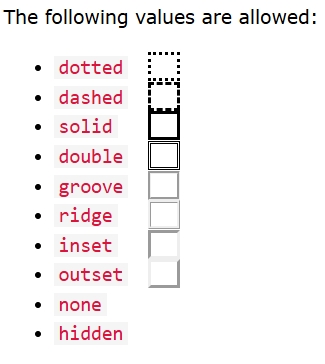

## Reference From
Document from: [Doc Mikelopster](https://www.w3schools.com/html/default.asp) 
Document from: [KongRuksiam Official](https://www.youtube.com/watch?v=0hfeNPM7piw&t=1308s)

## Basic Html
* The `<html>`element is the root element of an HTML page. 
* The `<head>` element contains meta information about the HTML page.
* The `<title>` element specifies a title for the HTML page //ชื่อเว็บที่ขึ้นบนแท็บบาร์
* The `<body>` element defines the document's body, and is a container for all the visible contents.
* The `<h1>` element defines a largest heading
* The `<h6>` element defines a smallest heading
* The `
` element defines a paragraph
* The ` ` element defines a line break(New lines).
* The `
` element is used to separate content(เส้นขีดยาว)
* The `<pre>` element defines preformatted text.(เว้นตามที่เราพิมเป๊ะๆ)

ex. คำสั่งที่ใช้ขยายในคำสั่งอีกที เช่น `
Menu
` title ในที่นี้คือถ้าเอาเม้าส์ำปชี้พารากราฟมันจะขึ้นคำอธิบายว่าeiei*

## Style
* The style attribute is used to add styles to an element, such as color, font, size, and more //กำหนดขนาด,สี,ฟอนต์
* ` bgcolor="..สี.." ` พื้นหลังทั้งหน้าเว็บ

<pre><b>All of this is CSS Attribute</b>
- Use `background-color` for background color
- Use `color` for text colors
- Use `font-family` for text fonts
- Use `font-size` for text sizes
- Use `text-align` for text alignment
- Use `text-decoration` for text decoration
- Use `background-size` to cover
- Use `background-attachment` to fixed
- Use `background-repeat` to repeat
- Use `border-radius` to get the borders get rounded corners
- Use `float` to let the image float R or L
- `border-spacing` is the space between each cell(default is 2px)
- `padding` is the space between the cell edges and content
- Add a background color on other line `td/th/tr:nth-child(even/odd)`zebra stripes
</pre>

* The `lang` attribute of the <html> tag declares the language of the Web page//ใช้กำหนดภาษาของhtml
* The `title` attribute defines some extra information about an element 

## Html Links

* Html Links ( `<a>` ) => The link's destination is specified in the href attribute. 
ex. `<a href="page2.html">P2</a>` // inline page2.html is a link that u want to connect, P2 is Name of a link

❌ สิ่งที่ HTML ไม่สามารถทำได้โดยตรง
-กำหนดความกว้างของทั้ง viewport (ขนาดของหน้าจอแสดงผล)
-บังคับให้เบราว์เซอร์แสดงเนื้อหาในขนาดที่แน่นอนโดยไม่มี CSS
-จัดวางตำแหน่งหรือเลย์เอาต์แบบ responsive

🔎 สรุป
HTML สามารถควบคุมขนาดบางส่วนได้ เช่น ตารางหรือ iframe แต่ไม่สามารถ "กำหนดขนาดหน้าเว็บทั้งหมด" ได้จริงจัง หากไม่ใช้ CSS
หากอยากกำหนดขนาดแบบแน่นอน แนะนำให้ใช้ CSS แม้จะเป็น inline style เช่น: `<body style="width:800px; height:600px;">`

## Html image

✅โค้ดตัวอย่างการใส่รูปในเว็บ 
ex. ``  
=> The src attribute of  specifies the path to the image to be displayed 
=> `alt="..."` → ข้อความอธิบายรูป (สำคัญสำหรับการเข้าถึง และกรณีโหลดภาพไม่ขึ้น) 
   -The alt attribute of  provides an alternate text for an image 

 

✅ วิธีที่ 1: ใช้ attribute border กับ  
ex. ``  
    -The width and height attributes of  provide size information for images 

 

📌 ผลลัพธ์: 
* รูปอยู่ในตารางที่มีกรอบ `cellpadding="5"` ช่วยเพิ่มช่องว่างระหว่างรูปกับกรอบ
* วิธีนี้จะดูเป็นกล่องชัดเจนขึ้น ถ้าต้องการกรอบที่ใหญ่ขึ้นสามารถเพิ่ม `border="5" หรือ cellpadding="10"` ได้
* ใช้ `border` กับ `` → ง่ายและตรงไปตรงมา
* ใช้ `<table>` → ได้กรอบชัดเจนกว่า และจัดรูปอยู่ตรงกลางได้ง่าย 
_**ใช้ CSS จะควบคุมสี กรอบ และมุมมนของรูปได้ เช่น border-radius และ border-color 😊**_

**Image Maps** => `<map>` tag defines an image map. An image map is an image with clickable areas. The areas are defined with one or more `<area>` tags.
* The usemap value starts with a hash tag # followed by the name of the image map.
* Create Image Map -> add a `<map>` element to create an image map, and is linked to the image by using the required `name` attribute.(have the same value as the ``'s `usemap` attribute)Then, add the clickable areas using an `<area>` element.
<pre>
   `rect` - defines a rectangular region
   `circle` - defines a circular region
   `poly` - defines a polygonal region
   `default` - defines the entire region
</pre>
_The coordinates for shape_ ="rect" come in pairs, one for the x-axis and one for the y-axis.
* Background Images use the HTML `style` attribute and the CSS `background-image`
* If you want the entire page to have a background image,use `<body>`
* `<picture>` allows you to display different pictures for different devices or screen sizes.

    
## Html tables
* `<table>` Defines a table
* `<th>` Defines a header cell in a table
* `<tr>` Defines a row in a table
* `<td>` Defines a cell in a table
* `<caption>` Defines a table caption
* `<colgroup>` Specifies a group of one or more columns in a table for formatting
* `<col>` Specifies column properties for each column within a `<colgroup>` element
* `<thead>` Groups the header content in a table
* `<tbody>`	Groups the body content in a table
* `<tfoot>`	Groups the footer content in a table
* `colspan` spans over two or more columns.
* `rowspan` spans over two or more rows.

**Table Borders** => CSS

## Html List
* `<ul>`	Defines an unordered list//doted
   * The CSS `list-style-type:` property define the style of the list item marker.
   * `disc` Sets the list item marker to a bullet (default)//black dot
   * `circle` Sets the list item marker to a circle//white dot
   * `square` Sets the list item marker to a square
   * `none` The list items will not be marked
   
* `<ol>`	Defines an ordered list//number(1 default)
   * `<ol type="1/A/a/I/i">` Start with 1/A/a/I(upper Roman num)/i(lower Roman num)
   *  ` start="?"` Start counting from type u choose
* `<li>`	Defines a list item
* `<dl>`	Defines a description list
* `<dt>`	Defines a term in a description list
* `<dd>`	Describes the term in a description list

**ex.**
*  `<ol>`	Defines an ordered list
    <OL TYPE = a>
      <LI> Oranges </LI> 
      <LI> Peaches </LI> 
      <LI> Grapes </LI> 
    </OL>
* `<ul>`	Defines an unordered list ,disc
   <ul list-style-type:disc>
      <li> Oranges </li> 
      <li> Peaches </li> 
      <li> Grapes </li> 
    </ul>
* `<dl>`	Defines a description list
    <dl>
      <dt>Coffee</dt>
      <dd>- black hot drink</dd>
      <dt>Milk</dt>
      <dd>- white cold drink</dd>
   </dl>
    

## Html Formatting
* `<b>` - Bold text
* `<strong>` - Important text
* `<i>` - Italic text
* `<em>` - Emphasized text
* `<mark>` - Marked text
* `<small>` - Smaller text
* `<del>` - Deleted text
* `<ins>` - Inserted text
* `` - Subscript text
* `` - Superscript text

## Html Quotation

<!--## Html comment-->
**<!-- This is a comment -->**
**<!-- 
This is another paragraph 
 -->**

## Html Color
**rgb(red, green, blue)** 
* defines the intensity of the color with a value between 0 and 255.
* display black, set all color parameters to 0, like this: rgb(0, 0, 0).
* display white, set all color parameters to 255, like this: rgb(255, 255, 255).
**rgba(red, green, blue, alpha)**
* number between 0.0 (fully transparent) and 1.0 (not transparent at all)
**HEX Color Values**
* in the form: #rrggbb values between 00 and ff.
<pre>
#ff0000 => red      | #000000 => black
#00ff00 => green    | #ffffff => white
#0000ff => blue
</pre>
**HSL Color Values**
* in the form: hsl(hue, saturation, lightness)
* Hue is a degree on the color wheel from 0 to 360. 0 is red, 120 is green, and 240 is blue.(ทุกสี)
* Saturation is a percentage value. 0% means a shade of gray, and 100% is the full color.(เทา->สีเต็ม)
* Lightness is also a percentage value. 0% is black, and 100% is white.(ดำ->ขาว)
 

**hsla(hue, saturation, lightness, alpha)**

## HtmlStyles - CSS
**Inline** - by using the style attribute inside HTML elements  ex. `<h1 style="color:blue;">A Blue Heading</h1>`  
**Internal** - by using a `<style>` element in the `<head>` section  
**External** - by using a `<link>` element to link to an external CSS file 
* Use the HTML <head> element to store `<style>` and `<link>` elements
* The CSS margin property defines a margin (space) outside the border.
* The CSS padding property defines a padding (space) between the text and the border.
* The CSS border property defines a border around an HTML element.

  

## HTML Links 
* The HTML `<a>` tag defines a hyperlink. ex. `<a href="url">link text</a>` 
* The `target` attribute specifies where to open the linked document.
  <pre>
   `_self` - Default. Opens the document in the same window/tab as it was clicked
   `_blank` - Opens the document in a new window or tab//ขึ้นtabใหม่
   `_parent` - Opens the document in the parent frame
   `_top` - Opens the document in the full body of the window
  </pre>
**Absolute URLs vs. Relative URLs**
  * Absolute URLs => a full web address. 
  * Relative URLs =>A local link (a link to a page within the same website) is specified with a relative URL (without the `https://www` part). 
  
**Use an Image as a Link** => Just put the `` tag inside the `<a>` tag.

**Link to an Email Address** => Use `mailto:` inside the href attribute to create a link that opens the user's email program.

**Button as a Link** =>`<button onclick="document.location='default.asp'">HTML Tutorial</button>`(Javascript).

**Link Titles** => ใส่ชื่อให้ลิ้งก์ 
* Use the id attribute (id="value") to define bookmarks in a page
* Use the href attribute (href="#value") to link to the bookmark

 

## HTML Favicon
A favicon image is displayed to the left of the page title in the browser tab, like this: 

