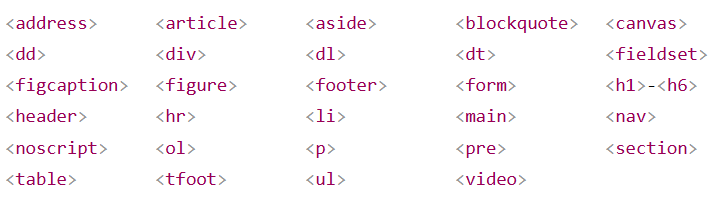
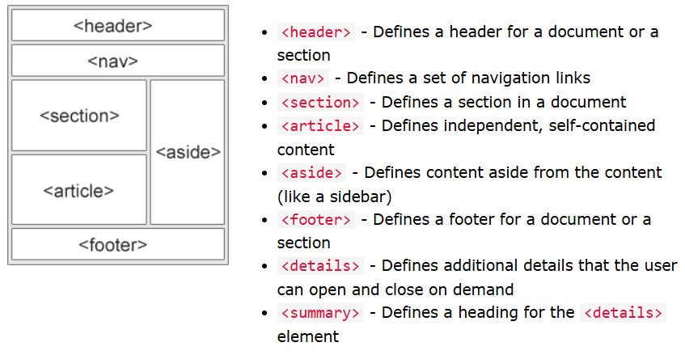

## Reference From
Document from: [Doc ](https://www.w3schools.com/html/default.asp) 
Document from: [KongRuksiam Official](https://www.youtube.com/watch?v=0hfeNPM7piw&t=1308s)

## Basic Html
* The `<html>`element is the root element of an HTML page. 
* The `<head>` element contains meta information about the HTML page.
* The `<title>` element specifies a title for the HTML page //ชื่อเว็บที่ขึ้นบนแท็บบาร์
* The `<body>` element defines the document's body, and is a container for all the visible contents.
* The `<h1>` element defines a largest heading
* The `<h6>` element defines a smallest heading
* The `
` element defines a paragraph
* The ` ` element defines a line break(New lines).
* The `
` element is used to separate content(เส้นขีดยาว)
* The `<pre>` element defines preformatted text.(เว้นตามที่เราพิมเป๊ะๆ)

ex. คำสั่งที่ใช้ขยายในคำสั่งอีกที เช่น `
Menu
` title ในที่นี้คือถ้าเอาเม้าส์ำปชี้พารากราฟมันจะขึ้นคำอธิบายว่าeiei*

## Style
* The style attribute is used to add styles to an element, such as color, font, size, and more //กำหนดขนาด,สี,ฟอนต์
* ` bgcolor="..สี.." ` พื้นหลังทั้งหน้าเว็บ

<pre><b>All of this is CSS Attribute</b>
- Use `background-color` for background color
- Use `color` for text colors
- Use `font-family` for text fonts
- Use `font-size` for text sizes
- Use `text-align` for text alignment
- Use `text-decoration` for text decoration
- Use `background-size` to cover
- Use `background-attachment` to fixed
- Use `background-repeat` to repeat
- Use `border-radius` to get the borders get rounded corners
- Use `float` to let the image float R or L
- `border-spacing` is the space between each cell(default is 2px)
- `padding` is the space between the cell edges and content
- Add a background color on other line `td/th/tr:nth-child(even/odd)`zebra stripes
- cellspacing="15" ระยะห่างระหว่างกล่องกับกล่อง
- cellpadding="0" ระยะห่างระหว่าง ข้อความกับกล่อง
</pre>

* The `lang` attribute of the <html> tag declares the language of the Web page//ใช้กำหนดภาษาของhtml
* The `title` attribute defines some extra information about an element 

## Html Links

* Html Links ( `<a>` ) => The link's destination is specified in the href attribute. 
ex. `<a href="page2.html">P2</a>` // inline page2.html is a link that u want to connect, P2 is Name of a link

❌ สิ่งที่ HTML ไม่สามารถทำได้โดยตรง
-กำหนดความกว้างของทั้ง viewport (ขนาดของหน้าจอแสดงผล)
-บังคับให้เบราว์เซอร์แสดงเนื้อหาในขนาดที่แน่นอนโดยไม่มี CSS
-จัดวางตำแหน่งหรือเลย์เอาต์แบบ responsive

🔎 สรุป
HTML สามารถควบคุมขนาดบางส่วนได้ เช่น ตารางหรือ iframe แต่ไม่สามารถ "กำหนดขนาดหน้าเว็บทั้งหมด" ได้จริงจัง หากไม่ใช้ CSS
หากอยากกำหนดขนาดแบบแน่นอน แนะนำให้ใช้ CSS แม้จะเป็น inline style เช่น: `<body style="width:800px; height:600px;">`

## Html image

✅โค้ดตัวอย่างการใส่รูปในเว็บ 
ex. ``  
=> The src attribute of  specifies the path to the image to be displayed 
=> `alt="..."` → ข้อความอธิบายรูป (สำคัญสำหรับการเข้าถึง และกรณีโหลดภาพไม่ขึ้น) 
   -The alt attribute of  provides an alternate text for an image 

 

✅ วิธีที่ 1: ใช้ attribute border กับ  
ex. ``  
    -The width and height attributes of  provide size information for images 

 

📌 ผลลัพธ์: 
* รูปอยู่ในตารางที่มีกรอบ `cellpadding="5"` ช่วยเพิ่มช่องว่างระหว่างรูปกับกรอบ
* วิธีนี้จะดูเป็นกล่องชัดเจนขึ้น ถ้าต้องการกรอบที่ใหญ่ขึ้นสามารถเพิ่ม `border="5" หรือ cellpadding="10"` ได้
* ใช้ `border` กับ `` → ง่ายและตรงไปตรงมา
* ใช้ `<table>` → ได้กรอบชัดเจนกว่า และจัดรูปอยู่ตรงกลางได้ง่าย 
_**ใช้ CSS จะควบคุมสี กรอบ และมุมมนของรูปได้ เช่น border-radius และ border-color 😊**_

**Image Maps** => `<map>` tag defines an image map. An image map is an image with clickable areas. The areas are defined with one or more `<area>` tags.
* The usemap value starts with a hash tag # followed by the name of the image map.
* Create Image Map -> add a `<map>` element to create an image map, and is linked to the image by using the required `name` attribute.(have the same value as the ``'s `usemap` attribute)Then, add the clickable areas using an `<area>` element.
<pre>
   `rect` - defines a rectangular region
   `circle` - defines a circular region
   `poly` - defines a polygonal region
   `default` - defines the entire region
</pre>
_The coordinates for shape_ ="rect" come in pairs, one for the x-axis and one for the y-axis.
* Background Images use the HTML `style` attribute and the CSS `background-image`
* If you want the entire page to have a background image,use `<body>`
* `<picture>` allows you to display different pictures for different devices or screen sizes.

    
## Html tables
* `<table>` Defines a table
* `<th>` Defines a header cell in a table
* `<tr>` Defines a row in a table
* `<td>` Defines a cell in a table
* `<caption>` Defines a table caption
* `<colgroup>` Specifies a group of one or more columns in a table for formatting
* `<col>` Specifies column properties for each column within a `<colgroup>` element
* `<thead>` Groups the header content in a table
* `<tbody>`	Groups the body content in a table
* `<tfoot>`	Groups the footer content in a table
* `colspan` spans over two or more columns.
* `rowspan` spans over two or more rows.

**Table Borders** => CSS

## Html List
* `<ul>`	Defines an unordered list//doted
   * The CSS `list-style-type:` property define the style of the list item marker.
   * `disc` Sets the list item marker to a bullet (default)//black dot
   * `circle` Sets the list item marker to a circle//white dot
   * `square` Sets the list item marker to a square
   * `none` The list items will not be marked
   
* `<ol>`	Defines an ordered list//number(1 default)
   * `<ol type="1/A/a/I/i">` Start with 1/A/a/I(upper Roman num)/i(lower Roman num)
   *  ` start="?"` Start counting from type u choose
* `<li>`	Defines a list item
* `<dl>`	Defines a description list
* `<dt>`	Defines a term in a description list
* `<dd>`	Describes the term in a description list

**ex.**
*  `<ol>`	Defines an ordered list
    <OL TYPE = a>
      <LI> Oranges </LI> 
      <LI> Peaches </LI> 
      <LI> Grapes </LI> 
    </OL>
* `<ul>`	Defines an unordered list ,disc
   <ul list-style-type:disc>
      <li> Oranges </li> 
      <li> Peaches </li> 
      <li> Grapes </li> 
    </ul>
* `<dl>`	Defines a description list
    <dl>
      <dt>Coffee</dt>
      <dd>- black hot drink</dd>
      <dt>Milk</dt>
      <dd>- white cold drink</dd>
   </dl>
    

## Html Formatting
* `<b>` - Bold text
* `<strong>` - Important text
* `<i>` - Italic text
* `<em>` - Emphasized text
* `<mark>` - Marked text
* `<small>` - Smaller text
* `<del>` - Deleted text
* `<ins>` - Inserted text
* `` - Subscript text
* `` - Superscript text

## Html Quotation

<!--## Html comment-->
**<!-- This is a comment -->**
**<!-- 
This is another paragraph 
 -->**

## Html Color
**rgb(red, green, blue)** 
* defines the intensity of the color with a value between 0 and 255.
* display black, set all color parameters to 0, like this: rgb(0, 0, 0).
* display white, set all color parameters to 255, like this: rgb(255, 255, 255).
**rgba(red, green, blue, alpha)**
* number between 0.0 (fully transparent) and 1.0 (not transparent at all)
**HEX Color Values**
* in the form: #rrggbb values between 00 and ff.
<pre>
#ff0000 => red      | #000000 => black
#00ff00 => green    | #ffffff => white
#0000ff => blue
</pre>
**HSL Color Values**
* in the form: hsl(hue, saturation, lightness)
* Hue is a degree on the color wheel from 0 to 360. 0 is red, 120 is green, and 240 is blue.(ทุกสี)
* Saturation is a percentage value. 0% means a shade of gray, and 100% is the full color.(เทา->สีเต็ม)
* Lightness is also a percentage value. 0% is black, and 100% is white.(ดำ->ขาว)
 

**hsla(hue, saturation, lightness, alpha)**

## HtmlStyles - CSS
**Inline** - by using the style attribute inside HTML elements  ex. `<h1 style="color:blue;">A Blue Heading</h1>`  
**Internal** - by using a `

I am a div

ถ้าประกาศไว้ข้างบนทุกตัวบล็อคที่ใส่ div จะมีสี-->  
การเว้นระยะห่างของภาพกับข้อความใช้แอตทริบิวต์
 * VSPACE =n สำหรับระยะยะห่างด้านบน ล่าง
 * HSPACE =n สำหรับระยะยะห่างด้านซ้าย ขวา 
 * margin: 10px 30px; → ระยะห่าง (เหมือน VSPACE = 10 และ HSPACE = 30)
 * padding คือ ระยะห่างภายใน ของกล่อง (ระยะระหว่างขอบของกล่องกับเนื้อหาด้านใน เช่น ข้อความ)

## HTML Iframes
An HTML iframe is used to display a web page within a web page.//เหมือนเว็บการ์ตูนที่เชื่อมเฟสไว้มุมขวาไว้ดูเพจที่แปล
* The HTML `<iframe src=".." title="..">` tag specifies an inline frame.
#Iframe - Target for a Link
* The target attribute of the link must refer to the name attribute of the iframe

## HTML JavaScript
The `<script>` element either contains script statements, or it points to an external script file through the src attribute.

## HTML Layout Elements
HTML has several semantic elements that define the different parts of a web page: 

## HTML Tags

* HTML for creating a checkbox is `<input type="checkbox">`=><input type="checkbox">

* The `<input type="text">` defines a single-line text field. The default width of the text field is 20 characters.=><input type="text"> //สำหรับช่องให้ user กรอกข้อความ

* The HTML for a drop-down list (also known as a select list) is created using the `<select>` tag, with options defined using the `<option>` tag. 
=><label for="cars">Choose a car:</label>
   <select name="cars" id="cars">
      <option value="volvo">Volvo</option>
      <option value="saab">Saab</option>
      <option value="opel">Opel</option>
      <option value="audi">Audi</option>
   </select>

* The `<textarea>` HTML element represents a multi-line plain-text editing control, useful when you want to allow users to enter a sizeable amount of free-form text, for example a comment on a review or feedback form. 
<textarea id="w3review" name="w3review" rows="4" cols="50">Type here</textarea>

* `<form>` สำหรับเปิดตัว form หลัก (จะใช้หรือไม่ใช้ก็ได้ เดี๋ยวจะมีอธิบายเพิ่มเติมในการส่ง form อีกที)
* `<input type='number'>` สำหรับช่องให้ user ใส่เลข
<input type='number'>
* `<input type='radio'>` สำหรับ radio ให้ user ติ้กเลือกได้
<input type="radio">
* `<input type='submit'>` ปุุ่มสำหรับให้ user มากดได้ เพื่อ submit form
* `<button></button>` ปุุ่มสำหรับให้ user มากดได้ (ที่จะใช้เพื่อ submit form หรือไม่ใช้ก็ได้)

Look for more HTML TAG : [Click link](https://www.w3schools.com/tags/tag_input.asp)

